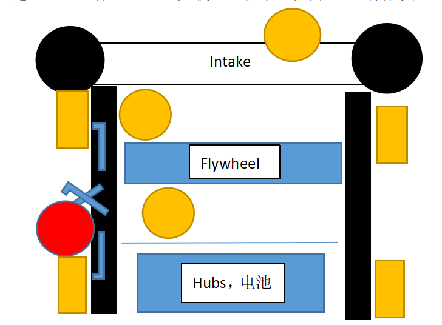

# 待验证方案

## 1. 四球并发

理论发射时间可减至1/4

理论有效射区：

- 自cell张开左右各54度（仅考虑宽度），约4块地垫
- 自cell张开左右各15度（考虑四球射程误差），约2块地垫

优越性目标：得分期望，射区占比，发射时长至少一项优于单飞轮

存在电机负载过大、球体碰撞发散及射程差的风险。
​​

## 2.四球抬升​​

金佩宇提出的方案采用侧面抬升管状结构，保留向花筐内扔4个球的战术能力

优越性目标：得分效率优于最优的发射方案

## 3.单球夹取

用外挂机械夹爪抓取nectar，无需预留大球进入车内空间。

可行性目标：能稳定抓取即可

## 4.windmill推球

用windmill推球，可实现大小球兼容

优越性目标：得分期望，射区占比，发射时长至少一项优于单飞轮

# 验证计划​​

​​设定验证时间节点​​：所有关键方案的原型机必须在10月7日前完成初步测试，未达目标者将不再考虑后续开发。

​​分配专项测试任务​​：针对不同方案的核心技术难点，指派专人负责对应的原型机制作与验证工作。

- 四球并发：由ljt协助制作并发发射原型机，重点验证多球同射的稳定性与电机负载。
- 四球抬升：由jpy负责制作抬升结构原型机，重点验证抬升动作的可靠性与大球小球进出流畅度。
- 夹球机制：程电验证机械舵机驱动的夹爪能否稳定抓取变形球，并测试单边或双边夹爪的可行性。

# 后续计划

- 并发成功：
  - 夹取成功：采用并发+夹取
  - 夹取失败：只采用并发
- 并发失败：
  - windmill推球成功：
    - 夹取成功：采用windmill推球+夹取
    - 夹取失败：只采用windmill推球
  - windmill推球失败：
    - 抬升成功：采取单发+抬升
    - 抬升失败：
      - 夹取成功：采用单发+夹取
      - 夹取失败：只采用单发

