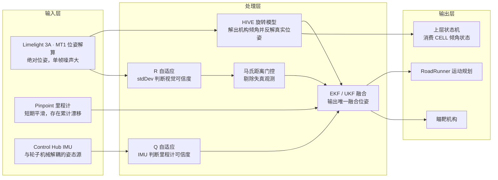
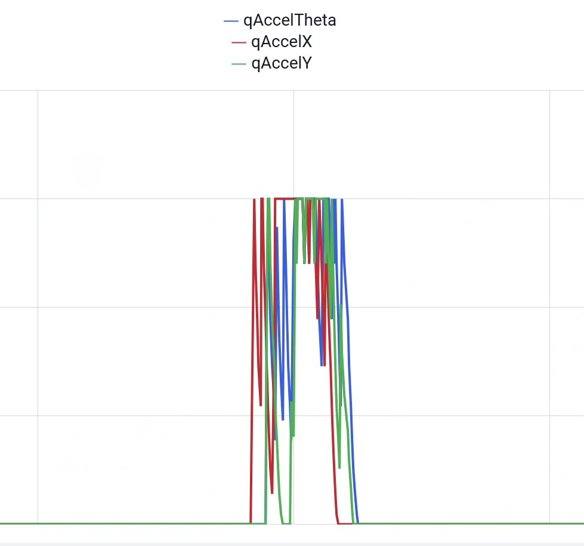
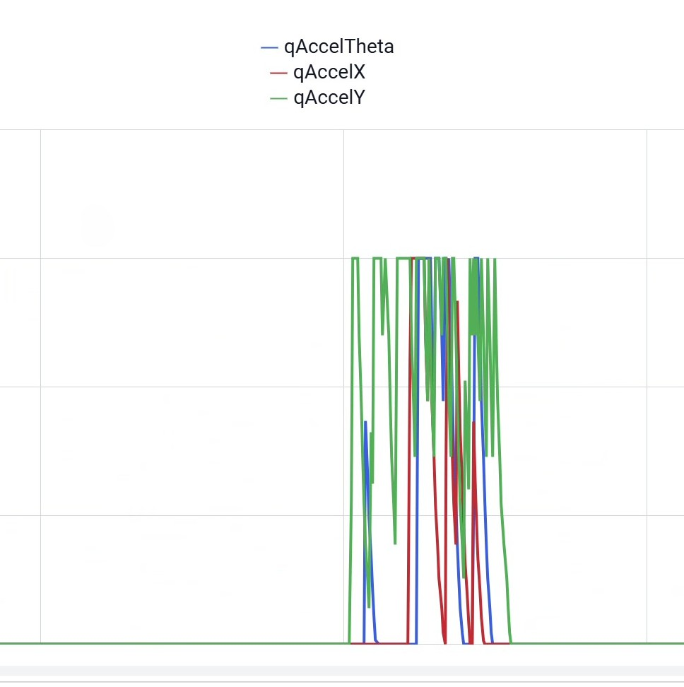
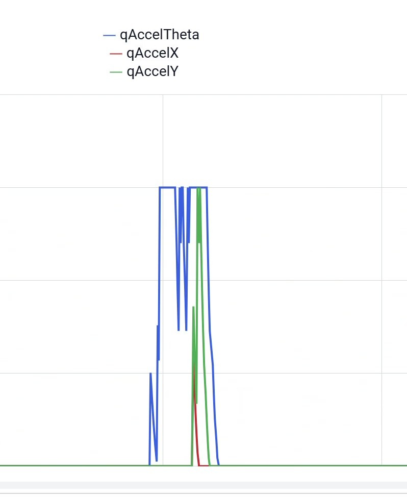
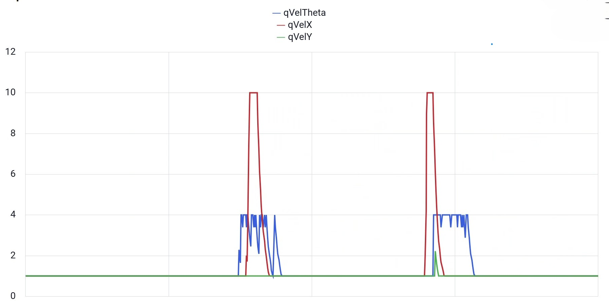
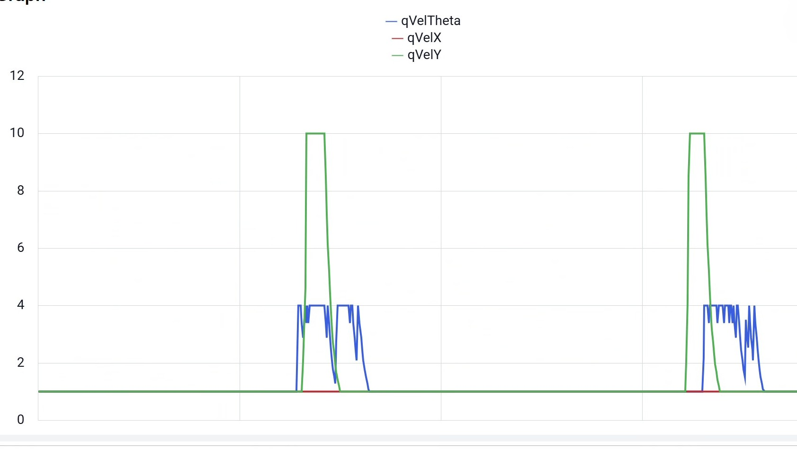

# 定位系统 · 工程笔记

***

## 一、背景与总体思路

在 DECODE 赛季中，我们使用视觉 / Pinpoint 两路定位器分别实现了自瞄算法，由操作手手动切换。但在实际比赛中，两种方式均有缺陷：视觉噪声较大，无法准确瞄准；Pinpoint 会产生累计误差，比赛后期会失效。

我们注意到，这一系统虽然收集了不同传感器的信息，但仅是分别独立处理。因此，我们基于现有经验，选用 EKF 将视觉与 Pinpoint 的信息进行融合，以提高定位精度。

但是，传统 EKF 仅能负责计算，无法适应比赛的复杂环境。因此，我们引入了强化学习中的自适应思想，利用 IMU 姿态数据和 Limelight 的观测标准差，动态估计 Pinpoint 与 Limelight 的可信度，从而动态调节融合权重，并通过实验验证了其相较传统 EKF 的优越性。
同时，针对 AprilTag 位置动态变化的问题，我们基于 HIVE 轴位置一定的特点列方程，通过对 botpose 的变换实现了任意 HIVE 角度的视觉定位。

### 系统总览



三条主线的存在理由：

- **HIVE 旋转模型**（第三章）：地图固定不变而 AprilTag 随机构倾斜，直接使用 botpose 会产生随距离线性放大的系统误差，故把机构倾角当作待估量解出来再反解真实位姿；
- **自适应 Q / R**（第二章）：两类传感器的误差统计都不平稳，固定权重必然在某一类场景下失效，故改为逐帧、逐方向评估可信度；
- **马氏距离门控**（第二章）：即使权重正确，"看起来正常"的退化观测仍会破坏状态，故在更新前再做一次整体一致性检验。

**术语约定**：HIVE 指场上带 AprilTag 的枢轴得分机构；MT1（MegaTag1）指 Limelight 的场地位姿解算算法；Pinpoint 指编码器 + IMU 的里程计计算器；"真实位姿"指机器人实际位姿，"原始位姿"指 Limelight 直接输出的受污染位姿，"修正位姿"指经 HIVE 模型反解得到的位姿，"融合位姿"指滤波器输出。

## 二、EKF 融合定位：从基线到自适应

### 基线实现

两路定位器各自独立工作，各自存在无法通过调参消除的缺陷：

- **视觉**：单帧解算噪声大、抖动明显，直接作为瞄靶输入会导致机构抖动，无法稳定精确瞄准；
- **Pinpoint**：短期平滑准确，但存在累计误差，比赛后期漂移足以让自瞄失效；
- 由操作手判断"何时该信哪一路"既不可靠也不可复现。

选择扩展卡尔曼滤波，把两路信息放进同一个状态估计里，而不是在输出端切换：

- **状态量**：$[x, y, \theta]$（平面位姿，英寸 / 弧度）；
- **预测**：以 Pinpoint 输出的速度（线速度 + 角速度）作为控制输入，按每帧 $dt$ 积分；
- **观测**：视觉有效时，把 `botpose` 转为 $(x, y, \theta)$（米 → 英寸、度 → 弧度）作为三维观测量输入；
- **输出**：融合位姿交给 RoadRunner 与瞄靶机构，速度输出继续供后续预测使用。

所有定位器统一实现 RoadRunner 的 `Localizer` 接口（`update()` / `getPose()` / `setPose()`），因此融合定位器可以在不改动运动规划与控制代码的前提下直接替换原有定位器。这条基线使用**构造时固定的** **$Q$** **与** **$R$**、视觉更新只做有效性过滤，作为后续所有改进的对照。

### 基线缺陷（对照实验暴露）

运行对照实验，同时挂载视觉、Pinpoint、EKF、UKF 四路输出并记录误差，三个场景依次给出不同结论：

- **视觉有效、正常距离**：融合定位器稳定收敛，MT1 偶尔出现无数据帧，其余定位器正常——说明融合框架成立；
- **视觉无效 / 受到撞击**：Pinpoint 出现小偏移，融合定位器在视觉恢复后缓慢收敛——单一传感器短暂失效不会破坏整体估计；
- **视觉有效但远离 AprilTag**：视觉误差远大于其自身噪声水平，不仅无法修正 EKF/UKF，反而把融合结果带偏。

第三个场景是本项目的关键转折点：**"数据有效"并不等于"数据可信"**。固定权重隐含假设两类传感器的误差统计平稳且各向同性，而这一假设在真实比赛中并不成立，这正是下一小节要解决的问题。

### 自适应改进：设计思想

为应对比赛中视觉质量与路面状况的强时变特性，我们引入自适应思想，让滤波器逐帧决定"该信谁、信多少"：用 IMU 判断里程计可信度以调节 $Q$，用视觉自身标准差判断观测可信度以调节 $R$，并辅以门控剔除失真观测。

卡尔曼滤波中 $Q$ 与 $R$ 的角色并不对称，这是设计自适应策略的前提：

- **$Q$** **决定两次观测之间协方差增长的速度**。在视觉缺失（被遮挡、被门控拒绝）的若干帧里，位姿完全由里程计预测推进，误差增长快慢由 $Q$ 决定；
- **$R$** **决定每一次视觉修正的力度**。它只影响"有观测的那一帧"的增益 $K$。

固定权重意味着隐式假设两类传感器的误差统计**平稳且各向同性**，而实际情况中二者均不成立。受强化学习中"根据当前环境反馈动态调整行为策略"思想的启发，我们设计了一个可解释的**启发式可信度评估器**取代固定权重——在每个方向、每一帧回答两个问题：

- 本帧里程计的位移有多可信？（由与编码器机械解耦的 IMU 判断）
- 本帧视觉的观测有多可信？（由 Limelight 自带 stdDev 及场景因子判断）

之所以采用"启发式"而非离线学习或在线梯度调参，是因为 hub 算力较低、无法支撑模型推理，而物理机理明确、解析可算的启发式最易标定与排障；其"可解释性"也便于在实验中将每个参数单独调优。

### 过程噪声 Q 自适应（IMU 工况驱动）

#### 误差工况与物理信号的对应

**检测思路**：Pinpoint 的误差本质都是"编码器读数不再等于机器人真实位移"，而这类事件必然同时引起**车身姿态的异常变化**；IMU 与轮子机械解耦、不受打滑影响，因此三种误差工况都能找到一个对应的 IMU 信号：

| 工况               | 误差机理                      | 可观测信号                  | 应对策略                |
| ---------------- | ------------------------- | ---------------------- | ------------------- |
| 撞击 / 急停（平整场地）    | 车轮受外力打滑，编码器输出虚假位移         | IMU 角**加速度**显著增大（短时冲击） | D2：放大对应方向 Q         |
| 坡度突变（场地存在不可忽略斜坡） | 爬坡/坡顶腾空，编码器测距失真           | IMU 角**速度**增大（持续倾转）    | D3：放大对应方向 Q         |
| 持续斜坡 / 长时腾空      | 坡面斜距 vs 水平距；Pinpoint 完全失效 | IMU 角**度**偏大           | 后续工作：水平投影 / 5D 状态方案 |

选择"角加速度还是角速度"的依据是信号的**时间形态**：撞击是持续约数帧的瞬态，微分后成为明显尖峰，而正常转弯的角速度平稳、微分后很小，因此**平整场地用角加速度**可以只响应撞击；坡度切换是持续一段时间的"速度级"事件，且转弯时 pitch/roll 角速度不变，因此**坡道场地用角速度**（以 pitch/roll 为主，排除 yaw 转弯）。此外，外力拧转机器人会使航向不可信，统一用 **yaw 角加速度**检测。

#### 检测信号的坐标变换与方向解耦

滤波器的位置状态 $x,y$ 位于场地坐标系，而撞击导致的不可靠运动方向是沿**机器人当前朝向**的。因此需把 IMU 读取的体坐标倾转分量按当前航向 $\theta$（取融合位姿航向，包含 `setPose` 偏移）旋转到场地坐标系：

$$
\boxed{
\begin{aligned}
f_X &= s_{\text{roll}}\cos\theta - s_{\text{pitch}}\sin\theta \\
f_Y &= s_{\text{roll}}\sin\theta + s_{\text{pitch}}\cos\theta
\end{aligned}}
$$

其中 $s_{\text{pitch}}$ 为绕前向轴的前后倾转分量、$s_{\text{roll}}$ 为绕右向轴的左右倾转分量（D2 用其**角加速度** $\alpha=\Delta s/\Delta t$，D3 用**角速度** $s$）。随后按"**交叉映射**"解耦方向：俯仰（前后倾）表明**纵向**撞击，故取 $|f_Y^{(\alpha)}|$ 触发 $q\text{Boost}X$；横滚（左右倾）表明**横向**撞击，故取 $|f_X^{(\alpha)}|$ 触发 $q\text{Boost}Y$；θ 方向只由 **yaw 角加速度**触发（外力拧转机器人才会让航向不可信）。

#### Boost 更新律：瞬态放大 + 指数衰减

撞击等事件跨越多个控制帧，且视觉往往在撞击瞬间恰好被遮挡，因此 boost 需要"记忆"：检测到冲击（$m > \Theta$）时按 $1+m/\Theta$ **乘性放大**，低于阈值时按 $\rho$ **指数衰减**，并钳位在 $[1,\ B_{\max}]$ 内——即"冲击越强放大越多、冲击结束后缓慢回落、正常行驶不引入额外噪声"。各方向独立采用如下更新律：

$$
\boxed{
b_{k+1} =
\begin{cases}
\min(B_{\max},\ b_k\,(1 + m/\Theta)), & m > \Theta \\[2pt]
\max(1.0,\ b_k \cdot \rho), & m \le \Theta
\end{cases}
}
$$

| 参数                     | 取值          | 含义                                            |
| :--------------------- | :---------- | :-------------------------------------------- |
| $\Theta_{\text{acc}}$  | 5.0 rad/s²  | D2 撞击（角加速度）的触发门限                              |
| $\Theta_{\text{jerk}}$ | 4.0 rad/s²  | θ 方向 yaw 旋转冲击的触发门限                            |
| $\rho$                 | 0.85 / 帧    | 衰减率，约 7 帧（0.14 s @50 Hz）衰减到 $e^{-1}$，形成"记忆"窗口 |
| $B_{\max}$             | 10          | boost 上限，防止极端工况下 $Q$ 过大导致协方差发散                |
| $q_{\text{base}}$      | 0.002 in²/s | 正常行驶时各方向的过程噪声基值                               |

工程实现上还有两点保护：**首帧不触发**（只采样上帧角速度，避免 $(s-0)/\Delta t$ 产生虚假大角加速度）；**`setPose`** **时复位** boost 与采样状态，保证视觉重定位后立即回到低噪声状态。最终过程噪声为对角阵，在每次预测前写入滤波器：

$$
Q = \operatorname{diag}\!\big(q_{\text{base}}\cdot q\text{Boost}X,\ q_{\text{base}}\cdot q\text{Boost}Y,\ q_{\text{base}}\cdot q\text{Boost}\theta\big),\qquad q_{\text{base}} = 0.002\ \text{in}^2\text{/s}
$$

直观效果：撞击发生的瞬间及随后一小段时间内，$P^{-}$ 增长加快 → $K$ 变大 → 一旦视觉可信即被大幅拉回正确位姿；正常行驶时 $Q$ 回到基值，位姿平滑。

#### 实测 Q boost 触发波形

为验证上述判据在实车上的有效性，我们用数据采集 OpMode 实时记录各方向的 Q boost 曲线，分别在平整场地施加不同方向的撞击、在坡道上完成上下坡行驶，得到以下实测波形。

**（1）撞击工况（D2 角加速度判据）**


图 1：撞击时 X 方向 Q boost 响应——对应**纵向撞击**（前后方向）这一物理事件，其不可靠位移与前向倾转相关，boost 由 pitch 侧角加速度经交叉映射触发。


图 2：撞击时 Y 方向 Q boost 响应——对应**横向撞击**（左右方向）这一物理事件，boost 由 roll 侧角加速度经交叉映射触发。


图 3：撞击时 θ 方向 Q boost 响应——对应撞击中**机器人被外力拧转**这一物理事件，航向不可信，boost 由 yaw 角加速度触发。

**（2）坡道工况（D3 角速度判据）**


图 4：上/下坡时 X 方向 Q boost 响应——对应**机器人前后方向驶上/驶下坡道**这一物理事件（爬坡与坡顶腾空使编码器测距失真），boost 由 pitch 角速度触发。


图 5：上/下坡时 Y 方向 Q boost 响应——对应**坡面上出现左右倾转**的工况（前后向角速度不变、roll 分量显著），boost 由 roll 角速度触发，证明 D3 判据不会把转弯误判为坡道。

从图中可见：正常行驶（或匀速转弯稳态）时各方向 boost 保持在下限 1，即 $Q$ 处于基值、不引入额外噪声；受到撞击或坡度切换的瞬间，受影响方向迅速抬升，随后按 $\rho = 0.85$ 指数衰减回落，与上述更新律完全吻合。X/Y 方向由 pitch/roll 交叉映射后的场地分量触发、θ 方向仅由 yaw 旋转冲击触发，证实 D2/D3 判据能够有效区分"正常行驶"与"异常扰动"两类工况。

### 观测噪声 R 自适应（视觉 stdDev 驱动）

**可信度来源**：Limelight 固件为每次解算输出各方向的标准差 stdDev，我们以它为主估计视觉可信度。需要说明的是，上述自适应机制（Q 自适应、R 自适应、门控）**仅用于 AdaptiveEKF/UKF 等自适应定位器**；对照组 EKF/UKF 的 R 始终为构造时的固定常量，不随 stdDev 变化。

**stdDev → R 的映射**：位置（英寸）与航向（弧度）的噪声量级差异很大，故使用各自独立的阈值，单方向按"低于低阈值取基值、超过高阈值后继续线性放大"的方式映射：

$$
R_{\text{dir}} =
\begin{cases}
0.01, & \text{std} \le \sigma_{\text{low}} \\[2pt]
0.01 \cdot \big(1 + t\,(R_{\max} - 1)\big), \quad t = \dfrac{\text{std} - \sigma_{\text{low}}}{\sigma_{\text{high}} - \sigma_{\text{low}}}, & \text{std} > \sigma_{\text{low}}
\end{cases}
$$

各通道参数取值：

| 参数                              | 位置通道 $x,y$（英寸） | 航向通道 $\theta$（弧度） |
| :------------------------------ | :------------- | :---------------- |
| $\sigma_{\text{low}}$（取基值的上界）   | 2.0（≈0.05 m）   | 0.035（≈2°）        |
| $\sigma_{\text{high}}$（开始超界的下限） | 6.0（≈0.15 m）   | 0.175（≈10°）       |
| 基值                              | 0.01           | 0.01              |
| 最大倍数 $R_{\max}$                 | 20（两通道共用）      | 20                |

这里的关键设计决策是**不设上界**：早期实现把 R 限制在上界以内，导致远距离、少标签时视觉的真实误差远超 R 值，滤波器仍"过度信任"视觉而被带偏；去除上界后 R 能如实反映"强烈不信任"，并且该值还会参与马氏门控的计算，双重防护。

**上下文缩放因子**（仅作用于位置通道 $x,y$）：实验表明 stdDev **系统性低估**远距离、少标签场景下的真实误差，因此在 R 上再乘两个因子——**距离因子** $(d/D_{\text{ref}})^2$（$D_{\text{ref}}=1.0$ m，PnP 位置误差随距离近似二次增长）与**标签数因子** $\min\big(N_{\text{scale}},\ N_{\text{ref}}/n_{\text{tag}}\big)$（$N_{\text{ref}}=2$、$N_{\text{scale}}=4$，即单标签时位置噪声 ×2，0 标签已被有效性过滤排除）。最终观测噪声为

$$
R = \operatorname{diag}\big(r_X,\ r_Y,\ r_{\theta}\big),\qquad
r_X = r_Y = R_{\text{std}}\cdot\text{distFactor}\cdot\text{tagFactor},\qquad
r_{\theta} = R_{\text{std},\theta}
$$

其中 $R_{\text{std}}$ 由 $x$ 方向 stdDev（米→英寸）映射得到，$R_{\text{std},\theta}$ 由 yaw stdDev（度→弧度）映射得到。

### 视觉更新的马氏距离门控与"观测缺失"兜底

初始实验中曾观察到：视觉误差极大时会拉偏融合位姿，导致定位失效。即使 R 已按 stdDev 放大，失真解（如把某个远处误检标签当作真值）仍可能通过单点更新破坏状态。为此在每次视觉更新前加入**马氏距离门控**：

$$
\boxed{
d^2 = (z - \hat{x}^{-})^{\mathsf T}\big(P^{-} + R\big)^{-1}(z - \hat{x}^{-})
}
$$

仅当 $\sqrt{d^2} \le \text{GATE\_THRESHOLD}=4$ 时才接受本次观测，否则**丢弃该帧视觉**：不更新、不降低协方差，滤波器继续由里程计预测推进。马氏距离同时计入了"滤波器对自身位姿的不确定度 $P^{-}$"与"本次观测的不确定度 $R$"，比单独设定像素/像素残差阈值更合理；且因为 $R$ 是自适应值，门控天然随场景收紧或放松。

**设计上的消融对照**：为确保"固定权重基线"的纯粹性，对照组 EKF/UKF 使用构造时的固定 Q 与固定 R，视觉更新仅做有效性过滤，**不启用任何自适应与门控**；自适应定位器则同时启用上述三项机制。两组差异对应"自适应加权 + 门控"这一整体，因此二者的对比可直接检验该机制的总体收益；各改进项的独立贡献留待后续逐步消融实验进一步分离。

**观测缺失兜底**：当视觉无效或被门控拒绝时，滤波器持续 predict。由于 $P^{-}$ 随时间增长，一旦后续出现可信观测，$K$ 自动增大，位姿被快速拉回——系统具备"自愈"能力，这是纯里程计在视觉遮挡期间唯一可依赖的容错路径，也解释了为何上述 boost 衰减不宜过快。

### 单帧完整执行流程

以 AdaptiveEKF 为例，每帧执行顺序如下：

```
update():
  now = 时钟();  dt = now - lastTimestamp;  lastTimestamp = now
  vel = odom.update()                          # 1. 里程计速度（返回值供驱动前馈）
  Q   = adaptQ(dt)                             # 2. IMU 检测 → 各方向 boost → diag(Q)
  ekf.predict(vel.x, vel.y, vel.ω, now)        # 3. 预测（使用自适应 Q）
  if mt1.isValid():                            # 4. 视觉
      R   = adaptR()                           #    stdDev × 距离因子 × 标签因子
      ekf.setR(R)
      if gateVision(z, R):                     #    马氏距离门控
          ekf.update(z)                        #    更新（使用自适应 R）
  return vel
```

要点：自适应 Q 作用于预测前、自适应 R 与门控作用于更新前；`setPose()` 与视觉校准时会复位 boost、航向角速度采样等瞬态状态，保证重定位可重复。

### 典型场景下的系统行为

| 场景         | 过程噪声 Q          | 观测噪声 R         | 门控 | 系统行为               |
| ---------- | --------------- | -------------- | -- | ------------------ |
| 正常行驶       | 基值（boost≈1）     | 按 stdDev 动态    | —  | 平滑跟随里程计，视觉低频微调     |
| 撞击（D2）     | 角加速度触发对应轴 boost | 正常             | —  | 撞击后视觉恢复时快速收敛       |
| 坡度切换（D3）   | 角速度触发 boost     | 正常             | —  | 腾空期间不信任里程计，落地后快速回正 |
| 视觉部分遮挡     | 正常              | stdDev/距离/标签放大 | 通过 | 弱观测权重低，修正温和        |
| 视觉完全丢失     | 正常              | —              | 丢弃 | 纯里程计推进，$P$ 增长等待恢复  |
| 远距离/少标签失真解 | 正常              | 极大（无上界）        | 拒绝 | 离群观测被拒，不被带偏        |

### 实验验证

运行对照实验，同时挂载视觉、Pinpoint、EKF、UKF、AdaptiveEKF、AdaptiveUKF 六路输出并记录误差。下表把基线缺陷与改进效果放在同一组场景下对照：

| 实验场景             | 基线 EKF / UKF                            | AdaptiveEKF / AdaptiveUKF  |
| :--------------- | :-------------------------------------- | :------------------------- |
| 精度（正常距离、视觉有效）    | 稳定收敛，与视觉、Pinpoint 量级一致                  | 与基线相当，自适应机制不带来额外偏差         |
| 视觉无效 / 受到撞击      | 仅撞击时缓慢收敛，遮挡叠加撞击时**收敛失败**；Pinpoint 出现小偏移 | 积累极大 $Q$，**收敛极快**，及时回到正确位姿 |
| 视觉有效但远离 AprilTag | 以固定 R 完全信任噪声解，**被显著带偏**                 | 积累极大 $R$，且大误差解被门控拒绝，位姿保持稳定 |
| EKF 与 UKF 对比     | 平整场地定性实验中二者精度无显著差别                      | 同左                         |

核心结论：

1. **遮挡 + 撞击场景**：AdaptiveEKF 能及时收敛到正确位姿，而对照的固定权重 EKF 未能收敛，验证了 IMU 驱动的自适应 Q 机制的有效性；
2. **远离标签场景**：对照组以固定 R 完全信任噪声较大的视觉解而被显著带偏；自适应定位器通过 stdDev 放大 R 并配合门控抑制失真解，位姿保持稳定。这说明视觉质量动态变化时，固定权重难以兼顾"正常时平滑修正"与"异常时抗扰"，自适应 R 与门控共同解决了这一矛盾；
3. **EKF 与 UKF 对比**：在平整场地的定性实验中，未发现二者的定位精度有显著差别，因此后续实现以 EKF 为主、同时保留 UKF 作为对照。

## 三、HIVE 动态倾斜下的视觉定位

HIVE 有两个稳定状态（CELL 抬起 / 放下），CELL 抬起时其 AprilTag 随之绕机构轴倾斜，而上传到 Limelight 的场地地图是固定不变的水平参考态。二者的差异使 Limelight 解算出的位姿出现系统性误差：

- 机构绕轴旋转 $\theta$ 时，Limelight 输出的位姿相当于在真实位姿上**叠加了一个绕机构轴的旋转**；
- 位姿误差随"机器人与机构的水平距离 $d$"线性放大：旋转 $\theta$ 使位置产生 $2 d \sin(\theta/2)$ 的偏移（$\theta = 30^\circ$ 时约 $0.52\,d$），航向也存在同量级偏差；
- 误差还随 CELL 状态切换而突变，无法用一次性标定补偿。

**方案比较**：

| 方案              | 做法                                                | 评价                                  |
| :-------------- | :------------------------------------------------ | :---------------------------------- |
| 双地图             | 为两个稳定状态各上传一份只含朝上 CELL 的 4 个标签的场地地图，按状态切换 pipeline | 需要维护多份地图、状态判断在视觉之外、阻尼器导致的实际倾角偏离无法覆盖 |
| **单地图旋转模型（采用）** | 只上传水平参考态地图，把机构倾角作为**待估量**解出来，再反解真实位姿              | 地图唯一、无需切换；倾角成为可输出给上层状态机的观测量         |

**为什么不用双地图**：除了要维护多份地图外，更关键的是阻尼器会使机构实际倾角偏离标称值，"按状态切换地图"无法覆盖这一偏差，而单地图把它一并解了出来。此外，该方案要求"先知道 CELL 状态才能选地图"，而状态本身要靠视觉判断，形成重复依赖；单地图方案把倾角变成解算的**输出**，状态判断反而成了视觉模块的副产品。

### 数学推导

**核心依据**：机构绕一条**位置固定**的轴旋转（轴过 $(0,0,h)$、方向沿场地 $y$ 轴，$h$ 为轴距地高度），因此"地图坐标系 → 真实场地"之间只差一个绕该轴的旋转。设真实倾角为 $\theta$，则 Limelight 输出的原始位姿 $T'$ 与机器人真实位姿 $T$ 满足

$$
T' = R_{\text{rot}}(\varphi)\, T, \qquad \varphi = -\theta
$$

**（1）由机器人贴地约束解出** **$\varphi$** —— 把旋转写成坐标形式（$h$ 为轴高，机器人在真实坐标系中贴地 $z = 0$）：

$$
x' = x\cos\varphi - h\sin\varphi, \qquad
z' = -x\sin\varphi - h\cos\varphi + h
$$

整理 $z'$ 的表达式即得关于 $\varphi$ 的三角方程：

$$
A\sin\varphi + B\cos\varphi = C, \qquad A = x',\quad B = z' - h,\quad C = -h
$$

**（2）求解与取根** —— 标准三角方程，两族解为

$$
\varphi_1 = \alpha - \operatorname{atan2}(B, A), \qquad
\varphi_2 = \pi - \alpha - \operatorname{atan2}(B, A), \qquad
\alpha = \arcsin\!\left(\frac{C}{\sqrt{A^2+B^2}}\right)
$$

两族解恒相差 $\pi - 2\alpha$，一般情况下只有一族落在合理区间内。按 $|\varphi| \le$ `hiveCellUpAngleDeg` 筛选：超出的解直接舍弃；若两族都落在窗口内则取 $|\varphi|$ 较小者。可解性前提为 $|C| \le \sqrt{A^2+B^2}$。

**（3）为什么这个模型是封闭的** —— 把上式合成为复数形式：

$$
A + iB = x' + i(z'-h) = (x - ih)\, e^{-i\varphi}
$$

因此第一族根与"由真实几何直接给出的幅角"完全一致，解出的 $\varphi$ 满足 $e^{-i\varphi}$ 的精确表达式，于是

$$
\boxed{
\theta = -\varphi = \operatorname{atan2}(h, x) + \operatorname{atan2}(B, A)
}
$$

**结论：解出的倾角与机器人位置** **$x$** **无关，恒等于机构的真实倾角。** 这解释了为什么下面的数值核算与实机实验中，无论机器人站在哪里解出的倾角都一致——模型自洽，不存在需要标定的位置相关项。

**（4）位姿复原** —— 由解出的 $\varphi$ 还原真实位姿：

$$
x = x'\cos\varphi - z'\sin\varphi + h\sin\varphi, \qquad y = y'
$$

姿态同理左乘逆旋转 $R = R_y(-\varphi) R'$；只取二维航向时，用旋转矩阵第一列（即机器人 $x$ 轴在场坐标系中的方向）：

$$
\text{yaw} = \operatorname{atan2}\big(R_{10},\ \cos\varphi\,R_{00} - \sin\varphi\,R_{20}\big)
$$

其中 $R_{00} = \cos(yaw')\cos(pitch')$，$R_{10} = \sin(yaw')\cos(pitch')$，$R_{20} = -\sin(pitch')$。

**（5）两个阈值与状态分类** —— 倾角观测 $\theta$ 与两个阈值比较，逐帧分类：

| 条件                                                                            | 状态              | 含义              |
| :---------------------------------------------------------------------------- | :-------------- | :-------------- |
| 本帧无有效观测（无标签 / 无解 / 校验失败）                                                      | `UNKNOWN`       | 上层保持上一次已知状态，不切换 |
| $\lvert\theta\rvert \le \theta_{\text{down}}$                                 | `MIDDLE`        | CELL 放下，机构水平    |
| $\theta_{\text{down}} < \lvert\theta\rvert < \theta_{\text{up}}$，$\theta > 0$ | `AUDIENCE_UP`   | 稳定位于一侧（一侧抬起）    |
| $\theta_{\text{down}} < \lvert\theta\rvert < \theta_{\text{up}}$，$\theta < 0$ | `AUDIENCE_DOWN` | 另一侧抬起           |

其中 $\theta_{\text{up}}$（`hiveCellUpAngleDeg`）同时是**取根窗口上界与直接拒绝门限**，$\theta_{\text{down}}$（`hiveCellDownAngleDeg`）是 MIDDLE 与"稳定位于一侧"的分界。哪一侧对应正号由符号参数 `hivePositiveAngleIsAudienceUp` 决定，需实机标定。

该分类是**逐帧瞬时观测，不带滞回**——本模块只负责"把这一帧看到的东西说清楚"，滞回与状态保持交给上层状态机，避免在观测层引入隐藏状态。

### 初版缺陷与上游根因

实机第一次运行时，把机构抬到 30°，倾角输出却**始终是 0.00°**，与真实倾角完全无关。

**数学解释**：设解算模型 $F(\varphi) = x'\sin\varphi + (z'-h)\cos\varphi + h$，则

$$
F(0) = z'
$$

即**方程在** **$\varphi = 0$** **处的取值恒等于观测到的** **$z'$**。于是当 $|z'| \approx 0$ 时，$\varphi = 0$ 必然落在取根窗口内，位置通路给出的解退化为 $\varphi = 0$（即 $\theta = 0$）——与机构真实倾角无关。关键危害是：**这类帧的其他质量指标（标准差、标签数、残差）可能全部正常**，常规质量门无法剔除，因此滤波器会被"看起来完全正常"的错误倾角污染。

**上游根因（实机确认）**：$z'$ 塌陷并不是算法问题，而是两条配置问题导致位姿本身不含倾角信息：

1. Limelight 的 **`snap to ground`** **必须设为** **`No`**。该选项开启时 Limelight 会把解算位姿强行压到地面平面上，等价于 $z' \equiv 0$，倾角信息被完全抹掉；
2. **必须让相机只看到本方 HIVE 的 4 个标签**（通过调整相机俯仰角度实现）。混入其他固定标签或另一侧机构的标签时，位姿由这些标签主导，$z'$ 同样塌陷。

即"倾角信息全部装载在 $z'$ 里"，任何让 $z'$ 失去意义的上游配置都会使解算失去输入。

### 双通路交叉校验与改进

**（1）废弃无效的质量量，建立第二条独立信息通路**

初版用"由解出的 $\varphi$ 反算 $z$ 并与容差比较"作为质量校验。数学上这个量恒等于 0：$\varphi$ 是方程的解析根，反算得到 $z \equiv C + h = 0$。也就是说它既不会拦下任何一帧、也不会造成误拒，**完全不具判别力**，只是看起来像是在做校验。

改为引入**姿态通路的交叉校验**。关键在于 $\varphi$ 有两条相互独立的信息来源：

- **位置通路**：上面由 $z'$ 的贴地约束解出的 $\varphi$，其唯一载体是 $z'$；
- **姿态通路**：由 $R' = R_y(\varphi)R$ 且机器人贴地平放（真实 pitch ≈ 0），可得

$$
pitch' \approx \arcsin\big(\sin\varphi \cdot \cos(yaw')\big)
$$

两条通路在正常帧上必然一致；而 $z'$ 退化帧会让位置通路塌回 $\varphi \approx 0$，姿态通路却依然反映真实旋转。因此以

$$
\left| pitch' - \arcsin\big(\sin\varphi \cdot \cos(yaw')\big) \right| > \gamma_{\text{pitch}}
$$

为判据，**超过容差即整帧丢弃**（不输出倾角，也不输出位置修正量）。实现上使用 $\arcsin$ 形式而非除法，避免了 $\cos(yaw') \to 0$ 时的数值风险。

该判据的两条已知局限，已在代码注释与参数说明中显式记录：

1. 以"机器人贴地平放"为前提，机器人在斜坡上时会被误判为退化帧；
2. 航向接近 $\pm 90^\circ$ 时 $\cos(yaw') \to 0$，姿态通路对该旋转本身不携带信息，判据\*\*失去判别力（漏检）\*\*而非误判——这是物理限制，不是实现缺陷。

**（2）把"不可信帧"挡在滤波器之外**

解算失败时，位姿输出会回退为**未修正的原始位姿**，其误差可达 $0.52\,d$ 量级。此前所有融合路径只检查"是否拿到有效结果"，等于把受污染位姿送进滤波器。现将全部消费点的门控统一为

$$
\text{可用} = \texttt{isValid()} \ \wedge\ \texttt{isHiveEstimated()}
$$

即"有效"与"倾角解算成功"同时成立才允许更新，覆盖固定权重对照组的 EKF / UKF 与自适应组的 AdaptiveEKF / AdaptiveUKF，保证对照实验的可比性。

**（3）调试可观测性**

为把"数值上无法区分"的故障变成可诊断的现象，增加三组观测量并接入遥测与 Dashboard：原始位姿的 $z$ 与 pitch（倾角信息的载体）、本帧识别到的标签 ID 列表（确认只含本方标签）、以及姿态交叉校验偏差（判断某帧是被拒绝还是本就解算不出）。同时在 Dashboard 上**同时绘制原始位姿（橙）与修正位姿（绿）**：退化帧发生时橙色位姿跳动而绿色位姿不受影响，一眼即可分辨"观测坏了"还是"修正坏了"。

### 实验验证

**（1）数值核算（模型正确性）** —— 取地图为水平参考态、轴高 $h = 15$ in、机构真实倾角 30°，由模型可算出不同站位下 Limelight 应报出的 $z'$，再把这些观测代回解算：

| 机器人与轴的水平距离 $x$ (in) | 10    | 15    | 20    | 25    | 30    | 35    |
| :------------------ | :---- | :---- | :---- | :---- | :---- | :---- |
| 观测到的 $z'$ (in)      | 7.0   | 12.0  | 17.0  | 24.5  | 32.0  | 37.0  |
| 解算倾角 $\theta$       | 32.5° | 31.6° | 31.9° | 30.9° | 32.1° | 31.8° |

**与站位完全无关且约等于真实倾角**——这是模型的解析结论，而非对某次实验的拟合，对应"数学建模与解算"第（3）步的封闭性证明：表中六个站位解出的倾角几乎相同，正是 $\theta$ 不含 $x$ 的必然结果。作为对照，把 $z'$ 置零后解算恒为 **0.00°**（复现实机故障），而机构真正水平、$z'$ 仅含 0.3 in 噪声时解算为 0.29°，说明解算不会凭空造出倾角。

**（2）上游配置修复后的实机验证** —— 将 `snap to ground` 置为 `No`、并调整相机角度使其只能同时看到本方 4 个标签后：

- 机构置于水平：倾角 ≈ 0°，状态分类为 `MIDDLE`，姿态交叉校验偏差在容差内；
- 机构抬至 30°：原始 $z'$ 明显非零，解算倾角 ≈ 30°，状态分类正确，修正后位姿与真实摆放一致；
- 此前"偶发输出 0°"的离群帧，现在表现为"校验偏差突增 → 该帧被拒绝"，不再进入滤波器。

**（3）回归验证** —— 修正逻辑加入后，定位测试与融合对照测试均通过；采用按 A 键的视觉校准流程时，校准采样与解算使用同一可用性判据，因此起始位姿也保证是修正后的真实位姿，避免"用受污染位姿做初始位姿"导致的全程偏移。

### 联盟切换的可行性分析

比赛需要在红蓝两侧场地间切换（上传另一侧的场地地图）。对是否需要改动程序做了推导：

- `botpose` 的原点固定为**场地中心**、与联盟无关，因此输出坐标系不变；
- 场地关于中心呈 180° 点对称，轴所在的 $x = 0$ 平面在该对称下映射到自身 → 另一侧机构的轴同样位于 $x = 0$，模型假设不变；
- 解算方程在 $(x', \varphi) \to (-x', -\varphi)$ 下两边同时变号、**形式完全不变**，取根窗口与姿态校验同样不受影响。

因此**算法与代码无需改动**，但有两项必须同步：

1. **符号约定**：镜像使机构绕 $+y$ 的旋转反向，同一物理状态在另一侧地图下解出的倾角符号相反，故 `hivePositiveAngleIsAudienceUp` 需要实机确认（极可能翻转）；
2. **联盟相关的坐标数据**：起始位姿、测试点坐标、自动路径等属于数据而非算法，必须同步换成对应一侧的数值，否则会表现为"巨大的假偏差"。

## 四、经验总结

本节汇总本项目实际踩过的坑、定位手段与最终修复：第 1–4 条属于 HIVE 视觉通路，第 5–6 条属于融合权重，第 7–8 条属于底盘与校准流程。它们的共同结论是：**"看起来正常的数据"比"明显异常的数据"更危险**，因此排障的第一步永远是把原始观测量暴露出来。

| # | 现象                     | 根因                                                          | 定位手段                          | 修复                                             |
| - | :--------------------- | :---------------------------------------------------------- | :---------------------------- | :--------------------------------------------- |
| 1 | 远离 AprilTag 时融合位姿被视觉带偏 | 固定 R 隐含"数据有效即可信"，而真实误差被 stdDev 系统性低估                        | 六路对照实验记录误差                    | R 自适应（去除上界 + 距离/标签因子）叠加马氏距离门控                  |
| 2 | 遮挡叠加撞击后长时间不收敛          | 遮挡期间 $P$ 增长过慢，视觉恢复时增益不足                                     | Q boost 实测波形                  | IMU 驱动的 Q 自适应（瞬态放大 + 指数衰减）                     |
| 3 | 按 A 校准后的起始位姿仍有固定偏移     | 校准只判 `isValid()`，可能采样到未经修正的受污染位姿                            | 校准流程遥测                        | 采样条件改为与融合更新同一套可用性判据                            |
| 4 | 机构抬到 30°，倾角始终输出 0.00°  | Limelight `snap to ground` 开启，把解算位姿强行压到地面平面，等价 $z'\equiv 0$ | 打印原始位姿的 $z'$                  | `snap to ground` 置为 `No`                       |
| 5 | 配置修正后倾角仍偶发为 0          | 相机同时看到多于 4 个标签，位姿被其他标签主导，$z'$ 再次塌陷                          | 打印本帧识别到的标签 ID 列表              | 调整相机俯仰角，只保留本方 HIVE 的 4 个标签                     |
| 6 | "残差校验"从未拦截任何一帧         | 用解析根反算得到 $z \equiv C + h = 0$，该量恒为零、不具判别力                   | 数值推导 + 遥测恒显示 0.000            | 废弃该量，改为姿态通路交叉校验（pitch 一致性）                     |
| 7 | 偶发离群倾角仍被送进滤波器          | 退化帧的 stdDev、标签数等常规质量指标全部正常，常规质量门无法剔除                        | Dashboard 同时绘制原始位姿（橙）与修正位姿（绿） | 四路融合器的视觉门控统一为 `isValid() && isHiveEstimated()` |

***

